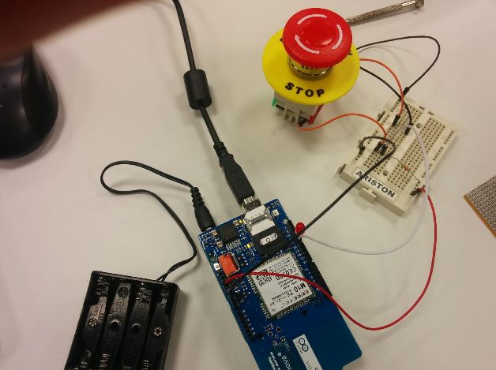

# arduino-gprs

This project was developed in a Hackaton in Telefónica R&D.

It uses an Arduino board + [Arduino GPRS Shield](https://www.arduino.cc/en/Main/ArduinoGSMShield) to make a HTTP request every time a button is toggled.

You must configure your own APN information:

```cc
#define GPRS_APN "sm2ms.movilforum.es"
#define GPRS_LOGIN ""
#define GPRS_PASSWORD ""
```



It is not production ready. Use it at your own risk.
